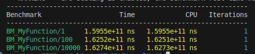
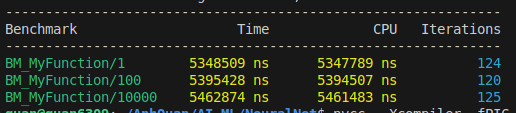

# A high performance C++ machine learning library
This is a light weight and high performance machine leaning library written entirely in C++. My aim is for people to use this library to run not just in their laptop or desktop but also in Iot devices which just have very limited memory.

## Table of content:
- [Contact](#contact)
- [Benchmark](#benchmark)
- [Roadmap](#roadmap)
- [Issues](#issue)
- [Usage](#usage)
- [Contributing](#contributing)
- [License](#license)

## Contact
- Email: tranlenanhquan6309@gmail.com
- Name: Quan Tran

## Benchmark
The following is a benchmark result of multiplying two matrices, each of which is of size 1000x1000

CPU


GPU


## Roadmap
- Make all tensor operations run on GPU if it is available.
- Implement the feedforward method of the Dense class to run on GPU.
- Implement loss function and backpropagation.

## Issues
- The Matrix and Tensor classes are templated but if I want to support CUDA, I'll need to compile my code or the user will have to install nvcc to compile their code. The second scenario is not so favorable, so I choose to wrap all CUDA kernels by some static methods of a template class `KernelWrap` but doing that means I have to manually instantiate the KernelWrap. So technically, right now the library can only support `int`, `float`, `double`. I still have not found any better solutions.

- It seems that CUDA has an amazing library called cuBLAS that provides blazing fast operations on matrices. Right now, every CUDA kernels I have implemented are so naive. Based on what I read on https://siboehm.com/articles/22/CUDA-MMM, it can be optimized even further.

- The Dense class's feedforward method is still relying on the overloaded operations of Tensor and Matrix but those overloaded operators involve allocating on GPU, copying to GPU, launch kernel, copy back to host, and free the allocated pointer on GPU. Allocating and copying every time a operation is performed is a waste of time. Ideally, the entire model should be kept on the GPU for training and we just need to allocate and copy once. 

## Usage
### 1. Tensor *(the most basic unit)*
- Mimic the multi-dimensional tensor just like in algebra.
- You can have as many dimensions as you want.
- It is a template class, so you have to specify the data type for the entry.
- Tensor class has method toString() which is inspired by Java toString(). toString() returns a std::string which visualize the Tensor. The style of the returned string is inspired by Pytorch tensor.
- Dimension of Tensor is a vector. Index of that vector tells the order of dimension.
    ```
    {1, 3, 4}    // 1 column, 3 rows, 4 channel
    {1, 3, 4, 5} // 1 column, 3 rows, 4 channel, 5 <whatever you call the 4th dimension is>
    ```
- Create an instance of tensor
    - from std::vector
    ```c++
    #include "tensor.hpp"
    
    int main(){
        // Dimension is {3, 2} which indicate that this tensor is basically a matrix with 3 columns and 2 rows.
        Tensor<float> tensor({0, 1, 2, 3, 4, 5}, {3, 2});

        // Print out to visualize the tensor
        std::cout << tensor.toString() << std::endl;
        /**
         * It will returns 

         [0.000000, 1.000000, 2.000000],
         [3.000000, 4.000000, 5.000000]
        */
    }
    ```
    - from array pointer
    ```c++
    #include "tensor.hpp"
    
    int main(){
        // Dimension is {3, 1, 3} which indicate that this tensor is a 3D object with 3 columns, 1 row, 3 channels.
        float arr[] = {0, 1, 2, 3, 4, 5, 6, 7, 8};
        Tensor<float> tensor(arr, {3, 1, 3});

        // Print out to visualize the tensor
        std::cout << tensor.toString() << std::endl;
        /**
         * It will returns 

         [[0.000000, 1.000000, 2.000000]],
         [[3.000000, 4.000000, 5.000000]],
         [[6.000000, 7.000000, 8.000000]]
        */
    }
    ```
    - or just dimension
    ```c++
    #include "tensor.hpp"
    
    int main(){
        Tensor<float> tensor({3, 1, 3});
    }
    ```

- Tensor uses shared pointer to keep track of the entries, so any tensor assignment using '=' does not create a separate chunk of entries but shared accross both instances.
    ```c++
    #include "tensor.hpp" 
    int main() {
        Tensor<int> tensor = anotherInstanceOfTensor;
        return 0;
    }
    ```
- Access each entry of a tensor using a position vector.
     ```c++
    #include "tensor.hpp" 
    #include <iostream>
    int main() {
        float arr[] = {0, 1, 2, 3, 4, 5, 6, 7, 8};
        Tensor<float> tensor(arr, {3, 1, 3});
        
        // Let say you want to access the entry at second column, first row, and third channel.
        std::cout << tensor({1, 0, 2}) << std::endl;
        // returns 7

        return 0;
    }
    ```
- Tensor class also overload the (+ -). So if you want to perform tensor addition or minus, no need to call any method. I do not really know how to implement a generic formula for tensor cross product, so I can only implement cross product for class Matrix which derives from class Tensor.
    ```c++
    #include "tensor.hpp" 
    #include <iostream>
    int main() {
        float arr1[] = {0, 1, 2, 3, 4, 5, 6, 7, 8};
        Tensor<float> tensor1(arr1, {3, 1, 3});
        
        float arr2[] = {0, 4, 5, 6, 7, 8, 9, 10, 11};
        Tensor<float> tensor2(arr2, {3, 1, 3});

        Tensor<float> tensor = tensor1 + tensor2;
        Tensor<float> tensor = tensor1 - tensor2;
        Tensor<float> tensor = -tensor2;
    }
    ```
### 2. Matrix *(derive from class Tensor)*
- Also has + - overloaded.
- Also support matrix multiplication with (*).
- 


